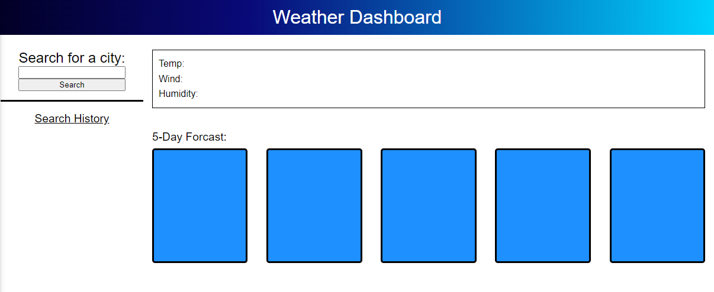

# weather-dashboard (INCOMPLETE)

=============================

## Description

A 5 day weather forecast dashboard.

- What was your motivation?
  I wanted to create a weather app.

- Why did you build this project?
  I wanted to build something that would give me experience with server side apis

- What problem does it solve?
  It lets you check the weather!

- What did you learn?
  I learned more about setting up a layout by scratch and how to use server side apis with javascript.

## Table of Contents (Optional)

If your README is long, add a table of contents to make it easy for
users to find what they need.

- [Installation](#installation)
- [Usage](#usage)
- [Credits](#credits)
- [License](#license)

## Installation

No installation needed.

## Usage

Input the city you want to search for and hit the search button.

## Credits

N/A

## License

N/A

---
